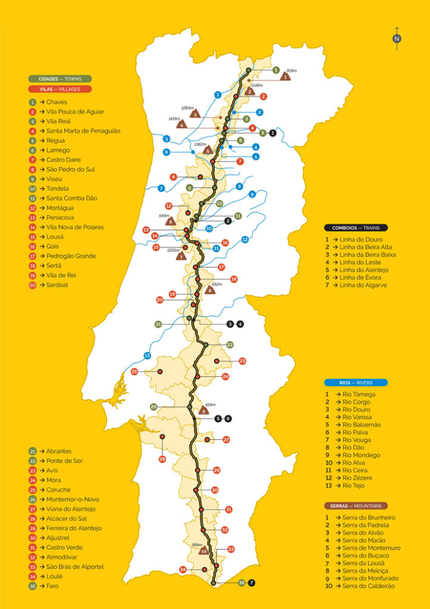

# Meu Guia da Estrada Nacional 2 (N2) de Moto — 10 Dias Solo

Fazer a Estrada Nacional 2 (N2) de moto sozinho é, sem dúvida, a nossa "Route 66" e uma das melhores experiências que você pode ter sobre duas rodas em Portugal.

Ter 10 dias é o tempo perfeito — permite que você faça a ligação de Lisboa a Chaves, desça os 738 km no seu ritmo, curta os desvios (como a parada que você quer fazer em Vouzela/Viseu) e volte para Lisboa no final sem nenhum estresse. Como especialista e motociclista, já te dou uma dica de ouro: a N2 não é para ser feita com pressa. É para viver as curvas, parar nas tascas, conversar com as pessoas e sentir a mudança drástica da paisagem de Norte a Sul.

Fiz este guia para me guiar e não me perder (rs), e também para que amigos e familiares possam acompanhar comigo essa viagem legal por este país que também já virou minha casa. Para começar, o essencial: o Passaporte da N2, os municípios por onde vou passar e como domar o GPS.

*A N2 de ponta a ponta: de Chaves (Km 0, no Norte) até Faro (Km 738, no Algarve).*

## 🧭 Legenda dos Ícones

Para você se orientar ao longo do guia:

**Links** (toque para abrir):
- 🗺️ **mapa** — localização no Google Maps
- 📷 **fotos** — imagens do local no Google Imagens (para "espiar" antes de chegar)

**Estrutura da viagem:**
- 🏍️ Início da etapa / começo do dia
- 🏨 Pernoite (hotel/hospedagem)
- 🏠 Pernoite (casa de amigos)
- 🛂 Carimbo do Passaporte N2
- 🏁 Fim da viagem

**Nas paradas:**
- 📸 🏛️ 🌳 🏖️ ⛪ ⛰️ 🏺 📍 🐟 🌊 🚶 — Visita / ponto de interesse
- 🍽️ 🥖 🍰 🍷 🥃 🥩 🥘 🧁 🥟 🦐 — Comida & bebida típica
- 🔒 — Dica prática (segurança, estacionamento)

## O Passaporte da N2 e os 35 Municípios

O Passaporte é o seu companheiro de viagem. O ideal é comprá-lo logo no Posto de Turismo de Chaves (perto do icônico marco do km 0) por um valor simbólico (cerca de 1€ a 2€).

Durante a viagem, você vai carimbando o passaporte em postos de turismo, prefeituras, cafés históricos, hotéis e até quartéis de bombeiros ao longo do caminho. Para completar o passaporte, você terá que recolher os carimbos destes 35 municípios (de Norte para Sul):

**Trás-os-Montes e Douro:**
1. Chaves (Distrito de Vila Real)
2. Vila Pouca de Aguiar (Distrito de Vila Real)
3. Vila Real (Distrito de Vila Real)
4. Santa Marta de Penaguião (Distrito de Vila Real)
5. Peso da Régua (Distrito de Vila Real)

**Beira Alta e Dão:**
6. Lamego (Distrito de Viseu)
7. Castro Daire (Distrito de Viseu)
8. São Pedro do Sul (Distrito de Viseu)
9. Viseu (Distrito de Viseu)
10. Tondela (Distrito de Viseu)
11. Santa Comba Dão (Distrito de Viseu)
12. Mortágua (Distrito de Viseu)

**Beiras e Pinhal Interior:**
13. Penacova (Distrito de Coimbra)
14. Vila Nova de Poiares (Distrito de Coimbra)
15. Lousã (Distrito de Coimbra)
16. Góis (Distrito de Coimbra)
17. Pedrógão Grande (Distrito de Leiria)
18. Sertã (Distrito de Castelo Branco)
19. Vila de Rei (Distrito de Castelo Branco)

**Ribatejo e Alto Alentejo:**
20. Sardoal (Distrito de Santarém)
21. Abrantes (Distrito de Santarém)
22. Ponte de Sor (Distrito de Portalegre)
23. Avis (Distrito de Portalegre)
24. Mora (Distrito de Évora)
25. Coruche (Distrito de Santarém)

**Alentejo Central e Baixo Alentejo:**
26. Montemor-o-Novo (Distrito de Évora)
27. Viana do Alentejo (Distrito de Évora)
28. Alcácer do Sal (Distrito de Setúbal)
29. Ferreira do Alentejo (Distrito de Beja)
30. Aljustrel (Distrito de Beja)
31. Castro Verde (Distrito de Beja)
32. Almodôvar (Distrito de Beja)

**Algarve:**
33. Loulé (Distrito de Faro)
34. São Brás de Alportel (Distrito de Faro)
35. Faro (Distrito de Faro)

---

## 🗺️ Mapa Visual das Etapas (Cidades, Quilometragens e Dicas Locais)

### Dia 1: Lisboa ➡️ Nazaré ➡️ Porto (Ligação Inicial com Desvio) | 340 km
- 🏍️ Início do Dia 1
- **Lisboa** [🗺️ mapa](https://www.google.com/maps/search/?api=1&query=Lisboa) | [📷 fotos](https://www.google.com/search?tbm=isch&q=Lisboa)
- 120km (Via Autoestrada A8)
- **Nazaré** [🗺️ mapa](https://www.google.com/maps/search/?api=1&query=Nazare) | [📷 fotos](https://www.google.com/search?tbm=isch&q=Nazare)
  - 📸 *Visita:* Pare a moto em frente ao **Farol da Nazaré (Forte de São Miguel Arcanjo)** [🗺️ mapa](https://www.google.com/maps/search/?api=1&query=Farol+da+Nazare+Forte+de+Sao+Miguel+Arcanjo) | [📷 fotos](https://www.google.com/search?tbm=isch&q=Farol+da+Nazare+Forte+de+Sao+Miguel+Arcanjo) para esticar as pernas e ver o famoso "Canhão da Nazaré".
  - 🍽️ *Comida:* Almoço de peixe fresco na **A Tasquinha** [🗺️ mapa](https://www.google.com/maps/search/?api=1&query=A+Tasquinha+Nazare) | [📷 fotos](https://www.google.com/search?tbm=isch&q=A+Tasquinha+Nazare) ou no **Rosa dos Ventos** [🗺️ mapa](https://www.google.com/maps/search/?api=1&query=Rosa+dos+Ventos+Nazare) | [📷 fotos](https://www.google.com/search?tbm=isch&q=Rosa+dos+Ventos+Nazare) (excelentes opções de peixe grelhado no centro da vila).
- 220km (Via A17/A29)
- **Porto** [🗺️ mapa](https://www.google.com/maps/search/?api=1&query=Porto) | [📷 fotos](https://www.google.com/search?tbm=isch&q=Porto) — 🏨 pernoite
  - 🔒 *Dica Prática:* Estacione a moto no hotel (certifique-se de que tem estacionamento privativo; o Porto é uma cidade fantástica, mas não é aconselhável deixar a moto carregada na rua).
  - 🍽️ *Comida:* Coma uma Francesinha (recomendo o **Brasão** [🗺️ mapa](https://www.google.com/maps/search/?api=1&query=Cervejaria+Brasao+Porto) | [📷 fotos](https://www.google.com/search?tbm=isch&q=Cervejaria+Brasao+Porto) ou o **Café Santiago** [🗺️ mapa](https://www.google.com/maps/search/?api=1&query=Cafe+Santiago+Porto) | [📷 fotos](https://www.google.com/search?tbm=isch&q=Cafe+Santiago+Porto)) no jantar.
  - 🚶 *Visita:* Passeio a pé pela **Ribeira** [🗺️ mapa](https://www.google.com/maps/search/?api=1&query=Ribeira+do+Porto) | [📷 fotos](https://www.google.com/search?tbm=isch&q=Ribeira+do+Porto) e **Ponte D. Luís** [🗺️ mapa](https://www.google.com/maps/search/?api=1&query=Ponte+D+Luis+I+Porto) | [📷 fotos](https://www.google.com/search?tbm=isch&q=Ponte+D+Luis+I+Porto).

### Dia 2: Porto ➡️ Chaves (Km 0) ➡️ Peso da Régua | 235 km
- 🏍️ Início do Dia 2
- **Porto** [🗺️ mapa](https://www.google.com/maps/search/?api=1&query=Porto) | [📷 fotos](https://www.google.com/search?tbm=isch&q=Porto)
- 150km (Subida rápida via A3/A24)
- **Chaves (Início Oficial da N2 - Km 0)** [🗺️ mapa](https://www.google.com/maps/search/?api=1&query=Chaves+Km+0+N2) | [📷 fotos](https://www.google.com/search?tbm=isch&q=Chaves+Km+0+N2)
  - 📸 *Visita:* Tire a foto obrigatória no Marco do Km 0 e pegue o Passaporte.
  - 🍽️ *Comida:* Jante os autênticos sabores transmontanos na histórica **Pensão Flávia** [🗺️ mapa](https://www.google.com/maps/search/?api=1&query=Pensao+Flavia+Chaves) | [📷 fotos](https://www.google.com/search?tbm=isch&q=Pensao+Flavia+Chaves) (reserve com antecedência).
  - 🥟 *Comida:* Prove o autêntico Pastel de Chaves quentinho.
- 15km
- **Vidago** [🗺️ mapa](https://www.google.com/maps/search/?api=1&query=Vidago) | [📷 fotos](https://www.google.com/search?tbm=isch&q=Vidago)
  - 🏛️ *Visita:* Contemple a arquitetura do **Vidago Palace** [🗺️ mapa](https://www.google.com/maps/search/?api=1&query=Vidago+Palace) | [📷 fotos](https://www.google.com/search?tbm=isch&q=Vidago+Palace) e o seu parque termal centenário.
- 15km
- **Vila Pouca de Aguiar** [🗺️ mapa](https://www.google.com/maps/search/?api=1&query=Vila+Pouca+de+Aguiar) | [📷 fotos](https://www.google.com/search?tbm=isch&q=Vila+Pouca+de+Aguiar)
  - 🏛️ *Visita:* Faça um breve desvio para espiar o **Complexo Mineiro Romano de Tresminas** [🗺️ mapa](https://www.google.com/maps/search/?api=1&query=Complexo+Mineiro+Romano+de+Tresminas) | [📷 fotos](https://www.google.com/search?tbm=isch&q=Complexo+Mineiro+Romano+de+Tresminas).
- 30km
- **Vila Real** [🗺️ mapa](https://www.google.com/maps/search/?api=1&query=Vila+Real) | [📷 fotos](https://www.google.com/search?tbm=isch&q=Vila+Real)
  - 🏛️ *Visita:* Os magníficos jardins do **Palácio de Mateus** [🗺️ mapa](https://www.google.com/maps/search/?api=1&query=Palacio+de+Mateus+Vila+Real) | [📷 fotos](https://www.google.com/search?tbm=isch&q=Palacio+de+Mateus+Vila+Real).
  - 🥧 *Comida:* Pare em uma confeitaria local para comer um doce chamado "Cristas de Galo".
- 25km
- **Peso da Régua** [🗺️ mapa](https://www.google.com/maps/search/?api=1&query=Peso+da+Regua) | [📷 fotos](https://www.google.com/search?tbm=isch&q=Peso+da+Regua) — 🏨 pernoite
  - 🍷 *Comida:* Beba uma taça de Vinho do Porto com vista para o Rio Douro.
  - 🏛️ *Visita:* **Museu do Douro** [🗺️ mapa](https://www.google.com/maps/search/?api=1&query=Museu+do+Douro+Peso+da+Regua) | [📷 fotos](https://www.google.com/search?tbm=isch&q=Museu+do+Douro+Peso+da+Regua) para entender a história da região demarcada.

### Dia 3: Peso da Régua ➡️ Vouzela (O Desvio de Lafões) | 77 km
- 🏍️ Início do Dia 3
- **Peso da Régua** [🗺️ mapa](https://www.google.com/maps/search/?api=1&query=Peso+da+Regua) | [📷 fotos](https://www.google.com/search?tbm=isch&q=Peso+da+Regua)
- 12km
- **Lamego** [🗺️ mapa](https://www.google.com/maps/search/?api=1&query=Lamego) | [📷 fotos](https://www.google.com/search?tbm=isch&q=Lamego)
  - 🏛️ *Visita:* **Santuário da Nossa Senhora dos Remédios** [🗺️ mapa](https://www.google.com/maps/search/?api=1&query=Santuario+da+Nossa+Senhora+dos+Remedios+Lamego) | [📷 fotos](https://www.google.com/search?tbm=isch&q=Santuario+da+Nossa+Senhora+dos+Remedios+Lamego) (a escadaria é incrível).
  - 🥖 *Comida:* Compre a mítica Bola de Lamego (recomendo a de carne ou presunto) para o almoço na estrada.
- 35km
- **Castro Daire** [🗺️ mapa](https://www.google.com/maps/search/?api=1&query=Castro+Daire) | [📷 fotos](https://www.google.com/search?tbm=isch&q=Castro+Daire)
  - ⛰️ *Dica Prática:* Aproveite as vistas incríveis das curvas da Serra de Montemuro.
  - 🍰 *Comida:* Prove o Bolo Podre de Castro Daire.
- 30km (Desvio panorâmico da N2 em direção a Lafões)
- **Vouzela** [🗺️ mapa](https://maps.google.com/?q=Vouzela) | [📷 fotos](https://www.google.com/search?tbm=isch&q=Vouzela) — 🏠 pernoite (casa de amigos)
  - 🔒 *Dica Prática:* Descanso merecido! Estacione a moto e durma na casa dos amigos Jessica e Rafa.
  - 📸 *Visita:* Passeio a pé pela **Ponte Romana de Vouzela** [🗺️ mapa](https://www.google.com/maps/search/?api=1&query=Ponte+Romana+de+Vouzela) | [📷 fotos](https://www.google.com/search?tbm=isch&q=Ponte+Romana+de+Vouzela) e a bela **Igreja da Misericórdia** [🗺️ mapa](https://www.google.com/maps/search/?api=1&query=Igreja+da+Misericordia+Vouzela) | [📷 fotos](https://www.google.com/search?tbm=isch&q=Igreja+da+Misericordia+Vouzela) com a sua fachada de azulejos.
  - 🍽️ *Comida:* Jante a famosa Vitela de Lafões na **Tasquinha de Lafões** [🗺️ mapa](https://www.google.com/maps/search/?api=1&query=Tasquinha+de+Lafoes+Vouzela) | [📷 fotos](https://www.google.com/search?tbm=isch&q=Tasquinha+de+Lafoes+Vouzela) e peça obrigatoriamente o doce conventual **Pastel de Vouzela** de sobremesa!

### Dia 4: Vouzela ➡️ Viseu ➡️ Lousã | 150 km
- 🏍️ Início do Dia 4
- **Vouzela** [🗺️ mapa](https://maps.google.com/?q=Vouzela) | [📷 fotos](https://www.google.com/search?tbm=isch&q=Vouzela)
- 30km (Retorno à rota N2)
- **Viseu** [🗺️ mapa](https://www.google.com/maps/search/?api=1&query=Viseu) | [📷 fotos](https://www.google.com/search?tbm=isch&q=Viseu)
  - 🛂 *Passaporte:* Não se esqueça de carimbar o seu Passaporte N2 no município nº 9!
  - 🏛️ *Visita:* O Centro Histórico, a **Sé de Viseu** [🗺️ mapa](https://www.google.com/maps/search/?api=1&query=Se+de+Viseu) | [📷 fotos](https://www.google.com/search?tbm=isch&q=Se+de+Viseu) e a **Cava de Viriato** [🗺️ mapa](https://www.google.com/maps/search/?api=1&query=Cava+de+Viriato+Viseu) | [📷 fotos](https://www.google.com/search?tbm=isch&q=Cava+de+Viriato+Viseu).
- 25km
- **Tondela** [🗺️ mapa](https://www.google.com/maps/search/?api=1&query=Tondela) | [📷 fotos](https://www.google.com/search?tbm=isch&q=Tondela)
  - 🏺 *Visita:* Conheça a **Olaria de Molelos** [🗺️ mapa](https://www.google.com/maps/search/?api=1&query=Olaria+de+Molelos+Tondela) | [📷 fotos](https://www.google.com/search?tbm=isch&q=Olaria+de+Molelos+Tondela) e as suas famosas louças de barro preto.
- 20km
- **Santa Comba Dão** [🗺️ mapa](https://www.google.com/maps/search/?api=1&query=Santa+Comba+Dao) | [📷 fotos](https://www.google.com/search?tbm=isch&q=Santa+Comba+Dao)
  - 🌳 *Visita:* Relaxe um pouco junto à foz do Rio Dão e à ecopista.
- 📸 *Visita Extra:* **Barragem da Aguieira** [🗺️ mapa](https://www.google.com/maps/search/?api=1&query=Barragem+da+Aguieira) | [📷 fotos](https://www.google.com/search?tbm=isch&q=Barragem+da+Aguieira). Pouco depois de Santa Comba Dão, encoste a moto nos mirantes laterais, monte o tripé e registre o espelho d'água gigantesco.
- 35km
- **Penacova** [🗺️ mapa](https://www.google.com/maps/search/?api=1&query=Penacova) | [📷 fotos](https://www.google.com/search?tbm=isch&q=Penacova)
  - 📸 *Visita:* **Miradouro de Penacova** [🗺️ mapa](https://www.google.com/maps/search/?api=1&query=Miradouro+de+Penacova) | [📷 fotos](https://www.google.com/search?tbm=isch&q=Miradouro+de+Penacova) com vista panorâmica sobre as curvas do Rio Mondego.
  - 🧁 *Comida:* Adoce a viagem com as "Nevadas de Penacova".
- 40km
- **Lousã** [🗺️ mapa](https://www.google.com/maps/search/?api=1&query=Lousa) | [📷 fotos](https://www.google.com/search?tbm=isch&q=Lousa) — 🏨 pernoite
  - 🏛️ *Visita:* Suba de moto até o **Castelo da Lousã** [🗺️ mapa](https://www.google.com/maps/search/?api=1&query=Castelo+da+Lousa) | [📷 fotos](https://www.google.com/search?tbm=isch&q=Castelo+da+Lousa) e perca-se no **Talasnal (Aldeia de Xisto)** [🗺️ mapa](https://www.google.com/maps/search/?api=1&query=Talasnal+Lousa) | [📷 fotos](https://www.google.com/search?tbm=isch&q=Talasnal+Lousa).
  - 🥘 *Comida:* Chanfana assada no forno a lenha e um cálice de Licor Beirão (que é original da Lousã).

### Dia 5: Lousã ➡️ Sertã | 90 km
- 🏍️ Início do Dia 5
- **Lousã** [🗺️ mapa](https://www.google.com/maps/search/?api=1&query=Lousa) | [📷 fotos](https://www.google.com/search?tbm=isch&q=Lousa)
- 15km
- **Góis** [🗺️ mapa](https://www.google.com/maps/search/?api=1&query=Gois) | [📷 fotos](https://www.google.com/search?tbm=isch&q=Gois)
  - 🏖️ *Visita:* Estacione e tome um café na **Praia Fluvial da Peneda** [🗺️ mapa](https://www.google.com/maps/search/?api=1&query=Praia+Fluvial+da+Peneda+Gois) | [📷 fotos](https://www.google.com/search?tbm=isch&q=Praia+Fluvial+da+Peneda+Gois).
- 50km
- **Pedrógão Grande** [🗺️ mapa](https://www.google.com/maps/search/?api=1&query=Pedrogao+Grande) | [📷 fotos](https://www.google.com/search?tbm=isch&q=Pedrogao+Grande)
  - 🌊 *Visita:* **Barragem do Cabril** [🗺️ mapa](https://www.google.com/maps/search/?api=1&query=Barragem+do+Cabril) | [📷 fotos](https://www.google.com/search?tbm=isch&q=Barragem+do+Cabril). A estrada passa literalmente por cima do paredão! É o lugar ideal para esticar as pernas, se hidratar e fotografar a moto entre o abismo e o rio Zêzere.
- 25km
- **Sertã** [🗺️ mapa](https://www.google.com/maps/search/?api=1&query=Serta) | [📷 fotos](https://www.google.com/search?tbm=isch&q=Serta) — 🏨 pernoite
  - 🍽️ *Comida:* Para o jantar, peça os tradicionais Maranhos da Sertã ou o Bucho Recheado.

### Dia 6: Sertã ➡️ Montemor-o-Novo | 175 km
- 🏍️ Início do Dia 6
- **Sertã** [🗺️ mapa](https://www.google.com/maps/search/?api=1&query=Serta) | [📷 fotos](https://www.google.com/search?tbm=isch&q=Serta)
- 25km
- **Vila de Rei** [🗺️ mapa](https://www.google.com/maps/search/?api=1&query=Vila+de+Rei+Centro+Geodesico) | [📷 fotos](https://www.google.com/search?tbm=isch&q=Vila+de+Rei+Centro+Geodesico)
  - 📍 *Visita:* Parada obrigatória no Picoto da Melriça (Centro Geodésico de Portugal). Você está exatamente no meio do país!
- 35km
- **Abrantes** [🗺️ mapa](https://www.google.com/maps/search/?api=1&query=Abrantes) | [📷 fotos](https://www.google.com/search?tbm=isch&q=Abrantes)
  - 🏛️ *Visita:* Suba ao **Castelo de Abrantes** [🗺️ mapa](https://www.google.com/maps/search/?api=1&query=Castelo+de+Abrantes) | [📷 fotos](https://www.google.com/search?tbm=isch&q=Castelo+de+Abrantes) para uma vista livre sobre o Rio Tejo.
  - 🍰 *Comida:* Leve na top case o doce típico "Palha de Abrantes".
- 35km
- **Ponte de Sor** [🗺️ mapa](https://www.google.com/maps/search/?api=1&query=Ponte+de+Sor) | [📷 fotos](https://www.google.com/search?tbm=isch&q=Ponte+de+Sor)
  - 🌳 *Visita:* Passeio tranquilo na zona ribeirinha.
- 📸 *Visita Extra:* **Barragem de Montargil** [🗺️ mapa](https://www.google.com/maps/search/?api=1&query=Barragem+de+Montargil) | [📷 fotos](https://www.google.com/search?tbm=isch&q=Barragem+de+Montargil). A N2 acompanha a margem da represa por vários quilômetros. Encoste, tire fotos com a água e as planícies e aproveite para fugir um pouco do calor alentejano.
- 35km
- **Mora** [🗺️ mapa](https://www.google.com/maps/search/?api=1&query=Mora) | [📷 fotos](https://www.google.com/search?tbm=isch&q=Mora)
  - 🐟 *Visita:* **Fluviário de Mora** [🗺️ mapa](https://www.google.com/maps/search/?api=1&query=Fluviario+de+Mora) | [📷 fotos](https://www.google.com/search?tbm=isch&q=Fluviario+de+Mora) (ótimo para sair do calor da roupa de moto por uma hora).
- 45km
- **Montemor-o-Novo** [🗺️ mapa](https://www.google.com/maps/search/?api=1&query=Montemor-o-Novo) | [📷 fotos](https://www.google.com/search?tbm=isch&q=Montemor-o-Novo) — 🏨 pernoite
  - 🏰 *Visita:* As ruínas do imponente **Castelo de Montemor-o-Novo** [🗺️ mapa](https://www.google.com/maps/search/?api=1&query=Castelo+de+Montemor-o-Novo) | [📷 fotos](https://www.google.com/search?tbm=isch&q=Castelo+de+Montemor-o-Novo).
  - 🥩 *Comida:* Você entrou no paraíso da Carne de Porco Preto Alentejano.

### Dia 7: Montemor-o-Novo ➡️ Almodôvar | 160 km
- 🏍️ Início do Dia 7
- **Montemor-o-Novo** [🗺️ mapa](https://www.google.com/maps/search/?api=1&query=Montemor-o-Novo) | [📷 fotos](https://www.google.com/search?tbm=isch&q=Montemor-o-Novo)
- 40km
- **Viana do Alentejo** [🗺️ mapa](https://www.google.com/maps/search/?api=1&query=Viana+do+Alentejo) | [📷 fotos](https://www.google.com/search?tbm=isch&q=Viana+do+Alentejo)
  - 🏛️ *Visita:* **Santuário de Nossa Senhora de Aires** [🗺️ mapa](https://www.google.com/maps/search/?api=1&query=Santuario+de+Nossa+Senhora+de+Aires+Viana+do+Alentejo) | [📷 fotos](https://www.google.com/search?tbm=isch&q=Santuario+de+Nossa+Senhora+de+Aires+Viana+do+Alentejo) (muito venerado pelos viajantes).
- 45km
- **Ferreira do Alentejo** [🗺️ mapa](https://www.google.com/maps/search/?api=1&query=Ferreira+do+Alentejo) | [📷 fotos](https://www.google.com/search?tbm=isch&q=Ferreira+do+Alentejo)
  - ⛪ *Visita:* **Capela do Calvário** [🗺️ mapa](https://www.google.com/maps/search/?api=1&query=Capela+do+Calvario+Ferreira+do+Alentejo) | [📷 fotos](https://www.google.com/search?tbm=isch&q=Capela+do+Calvario+Ferreira+do+Alentejo) (a sua arquitetura forrada de pedras redondas é única).
- 25km
- **Aljustrel** [🗺️ mapa](https://www.google.com/maps/search/?api=1&query=Aljustrel) | [📷 fotos](https://www.google.com/search?tbm=isch&q=Aljustrel)
  - ⛰️ *Visita:* **Miradouro do Santuário de Nossa Senhora do Castelo** [🗺️ mapa](https://www.google.com/maps/search/?api=1&query=Santuario+de+Nossa+Senhora+do+Castelo+Aljustrel) | [📷 fotos](https://www.google.com/search?tbm=isch&q=Santuario+de+Nossa+Senhora+do+Castelo+Aljustrel) (vista de 360º sobre as planícies mineiras).
- 30km
- **Castro Verde** [🗺️ mapa](https://www.google.com/maps/search/?api=1&query=Castro+Verde) | [📷 fotos](https://www.google.com/search?tbm=isch&q=Castro+Verde)
  - 🍽️ *Comida:* Aposte em um caprichado Ensopado de Borrego no almoço.
- 20km
- **Almodôvar** [🗺️ mapa](https://www.google.com/maps/search/?api=1&query=Almodovar) | [📷 fotos](https://www.google.com/search?tbm=isch&q=Almodovar) — 🏨 pernoite
  - 🥃 *Comida:* Depois de encostar a moto, tome uma Aguardente de Medronho produzida na serra algarvia ali do lado.

### Dia 8: Almodôvar ➡️ Faro (O Final da N2) | 75 km
- 🏍️ Início do Dia 8
- **Almodôvar** [🗺️ mapa](https://www.google.com/maps/search/?api=1&query=Almodovar) | [📷 fotos](https://www.google.com/search?tbm=isch&q=Almodovar)
- 55km (Mítica Serra do Caldeirão — Rota das 365 curvas)
- **São Brás de Alportel** [🗺️ mapa](https://www.google.com/maps/search/?api=1&query=Sao+Bras+de+Alportel) | [📷 fotos](https://www.google.com/search?tbm=isch&q=Sao+Bras+de+Alportel)
  - 🌳 *Visita:* **Miradouro do Alto da Arroteia** [🗺️ mapa](https://www.google.com/maps/search/?api=1&query=Miradouro+do+Alto+da+Arroteia+Sao+Bras+de+Alportel) | [📷 fotos](https://www.google.com/search?tbm=isch&q=Miradouro+do+Alto+da+Arroteia+Sao+Bras+de+Alportel). Aprecie a transição entre a serra e o mar ao longe.
- 20km
- **Faro (Fim da N2 - Km 738)** [🗺️ mapa](https://www.google.com/maps/search/?api=1&query=Faro+Rotunda+N2) | [📷 fotos](https://www.google.com/search?tbm=isch&q=Faro+Rotunda+N2) — 🏨 pernoite
  - 📸 *Visita:* A foto de glória na Rotatória do Km 738. Depois, caminhe pela **"Cidade Velha"** [🗺️ mapa](https://www.google.com/maps/search/?api=1&query=Cidade+Velha+Faro) | [📷 fotos](https://www.google.com/search?tbm=isch&q=Cidade+Velha+Faro) (centro histórico cercado de muralhas).
  - 🦐 *Comida:* Celebre o fim da N2 com uma Cataplana de Marisco típica do Algarve.

### Dia 9: Faro (Descanso Total) | 0 km
- **Faro** [🗺️ mapa](https://www.google.com/maps/search/?api=1&query=Faro) | [📷 fotos](https://www.google.com/search?tbm=isch&q=Faro)
  - 🏖️ *Visita:* Pegue o barco para a **Ilha Deserta** [🗺️ mapa](https://www.google.com/maps/search/?api=1&query=Ilha+Deserta+Faro) | [📷 fotos](https://www.google.com/search?tbm=isch&q=Ilha+Deserta+Faro) ou para a **Praia de Faro** [🗺️ mapa](https://www.google.com/maps/search/?api=1&query=Praia+de+Faro) | [📷 fotos](https://www.google.com/search?tbm=isch&q=Praia+de+Faro). O dia é livre para praia, descanso e gastronomia sem encostar na moto.

### Dia 10: Faro ➡️ Lisboa (Retorno Cênico pela Costa) | 300 km
- 🏍️ Início do Dia 10
- **Faro** [🗺️ mapa](https://www.google.com/maps/search/?api=1&query=Faro) | [📷 fotos](https://www.google.com/search?tbm=isch&q=Faro)
- 110km
- **Aljezur / Praia da Arrifana (Entrada na Costa Vicentina)** [🗺️ mapa](https://www.google.com/maps/search/?api=1&query=Praia+da+Arrifana) | [📷 fotos](https://www.google.com/search?tbm=isch&q=Praia+da+Arrifana)
  - 🏖️ *Visita:* Desvio obrigatório à Praia da Arrifana para ver as falésias imponentes.
  - 🍽️ *Comida:* Almoço no aclamado **Restaurante O Paulo** [🗺️ mapa](https://www.google.com/maps/search/?api=1&query=Restaurante+O+Paulo+Arrifana) | [📷 fotos](https://www.google.com/search?tbm=isch&q=Restaurante+O+Paulo+Arrifana) (dica de amigo), literalmente pendurado na falésia, com o melhor peixe e vista para o oceano.
- 60km
- **Vila Nova de Milfontes** [🗺️ mapa](https://www.google.com/maps/search/?api=1&query=Vila+Nova+de+Milfontes) | [📷 fotos](https://www.google.com/search?tbm=isch&q=Vila+Nova+de+Milfontes)
  - 🌊 *Visita:* Pare a moto junto ao estuário onde o rio Mira deságua no mar para a última grande fotografia da viagem.
- 130km
- **Lisboa** [🗺️ mapa](https://www.google.com/maps/search/?api=1&query=Lisboa) | [📷 fotos](https://www.google.com/search?tbm=isch&q=Lisboa) — 🏨 pernoite
  - 🏁 *Visita:* Fim da viagem! Chegada em segurança.

---

## ⚙️ Dicas Práticas de Sobrevivência para a Rota (Moto Solo)

1. **Viajar Sempre de Dia:** A N2 à noite esconde os perigos da queda de temperatura, da falta de iluminação e, sobretudo, do cruzamento com animais selvagens. Aproveite a luz natural para curtir as paisagens.
2. **Dinheiro Vivo como Reserva:** Leve entre 200€ e 300€ em notas pequenas (10€ e 20€). Muitas vilas, tascas e pequenas hospedagens no interior não aceitam cartões internacionais, funcionando apenas com dinheiro em espécie ou rede local.
3. **Passeio Noturno a Pé:** Ao chegar à cidade de destino, a regra é simples: guarde a moto em local seguro e conheça a cidade a pé ou de transporte público. Assim, você pode curtir um bom vinho regional sem preocupação com a direção.
4. **Bagagem Minimalista (mas Segura):** Aposte em uma mala enxuta. Leve camisetas, bermudas para a noite, chinelos e carregadores de celular. Mas, para pilotar, use calças próprias (Kevlar ou Cordura) em vez de jeans comum, pela sua segurança.
5. **A "Regra do Meio Tanque":** No Alentejo, as distâncias entre postos aumentam. Abasteça a moto sempre que o tanque chegar à metade.
6. **Controle do Calor:** Nos dias de planície (Dias 6 e 7), saia por volta das 8h00 para evitar pilotar sob temperaturas muito altas à tarde.
7. **Hidratação Contínua:** Considere levar um *Camelbak* para beber água em movimento, ou faça paradas frequentes só para se hidratar.
8. **Controle da Navegação:** O Google Maps vai tentar te jogar para vias rápidas. Ative sempre os filtros "Evitar rodovias" e "Evitar pedágios" para se manter no asfalto histórico.
9. **Pedágios Iniciais:** Garanta que você tem um identificador Via Verde válido para os pedágios eletrônicos (ex-SCUT) das autoestradas no início da viagem.
